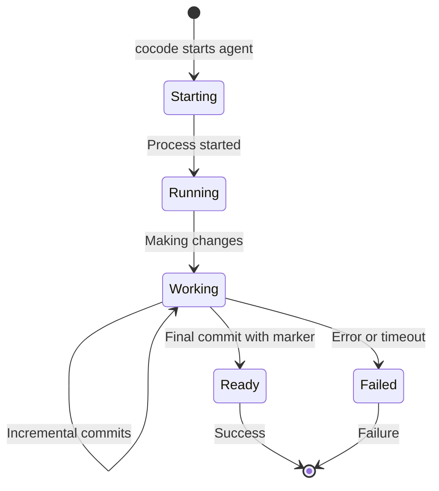

# Agent Protocol Specification

## Overview

This document defines the communication protocol between cocode and code agents.

## Agent Interface

### Input: Environment Variables

Agents receive context through environment variables:

| Variable | Type | Description | Example |
|----------|------|-------------|---------|
| `COCODE_REPO_PATH` | Path | Absolute path to repository | `/Users/dev/my-repo` |
| `COCODE_ISSUE_NUMBER` | Integer | GitHub issue number | `123` |
| `COCODE_ISSUE_URL` | URL | Full GitHub issue URL | `https://github.com/org/repo/issues/123` |
| `COCODE_ISSUE_BODY_FILE` | Path | Path to file containing issue body | `/tmp/cocode_issue_123.txt` |
| `COCODE_READY_MARKER` | String | Marker to include in final commit | `cocode ready for check` |

### Input: Working Directory

- Agent is executed with CWD set to its worktree
- Worktree is a clean checkout of the default branch
- Agent has full read/write access to the worktree

### Output: Git Commits

Agents communicate progress through git commits:

```bash
# Regular progress commits
git add .
git commit -m "feat: implement user authentication"

# Final commit with ready marker
git add .
git commit -m "fix: resolve issue #123

Implementation complete and tested.

cocode ready for check"
```

### Output: Log Streaming

Agents should output logs to stdout/stderr:

```json
{"timestamp": "2024-01-01T12:00:00Z", "level": "info", "message": "Starting analysis"}
{"timestamp": "2024-01-01T12:00:01Z", "level": "info", "message": "Found 3 files to modify"}
{"timestamp": "2024-01-01T12:00:02Z", "level": "error", "message": "Failed to parse config"}
```

Plain text output is also supported:

```
[INFO] Starting analysis
[INFO] Found 3 files to modify
[ERROR] Failed to parse config
```

## Agent Lifecycle



## Exit Codes

| Code | Meaning | Action |
|------|---------|--------|
| 0 | Success | Check for ready marker |
| 1 | General error | Mark as failed |
| 2 | Invalid arguments | Check agent config |
| 3 | Missing dependencies | Run doctor command |
| 124 | Timeout | Agent took too long |
| 130 | User interrupted | Cleanup required |

## Ready Detection

The ready marker must appear in the commit message subject or body:

### Valid Examples

```bash
# In subject
git commit -m "cocode ready for check"

# In body
git commit -m "Fix issue" -m "cocode ready for check"

# With other text
git commit -m "feat: add feature - cocode ready for check"
```

### Invalid Examples

```bash
# In code comments (not detected)
echo "// cocode ready for check" > file.js
git commit -m "Add comment"

# In file content (not detected)
echo "cocode ready for check" > README.md
git commit -m "Update README"
```

## Timeout Behavior

- Default timeout: 30 minutes
- Timeout is per-agent, not global
- On timeout, agent process is killed (SIGTERM, then SIGKILL)
- Partial work is preserved in worktree

## Error Handling

Agents should handle errors gracefully:

1. **Recoverable Errors**: Log and continue
2. **Fatal Errors**: Clean up and exit with appropriate code
3. **Network Errors**: Retry with exponential backoff
4. **Git Conflicts**: Exit with code 1 and clear message

## Performance Guidelines

1. **Incremental Commits**: Commit every significant change
2. **Log Buffering**: Flush logs regularly (line-buffered)
3. **Resource Usage**: Be mindful of CPU/memory
4. **File Operations**: Use bulk operations when possible

## Example Agent Implementation

```python
#!/usr/bin/env python3
import os
import sys
import json
import subprocess
from datetime import datetime

def log(level, message):
    print(json.dumps({
        "timestamp": datetime.utcnow().isoformat() + "Z",
        "level": level,
        "message": message
    }))
    sys.stdout.flush()

def main():
    # Read context
    repo_path = os.environ.get("COCODE_REPO_PATH")
    issue_number = os.environ.get("COCODE_ISSUE_NUMBER")
    issue_body_file = os.environ.get("COCODE_ISSUE_BODY_FILE")
    ready_marker = os.environ.get("COCODE_READY_MARKER")
    
    log("info", f"Starting work on issue #{issue_number}")
    
    # Read issue body
    with open(issue_body_file, 'r') as f:
        issue_body = f.read()
    
    log("info", "Analyzing issue...")
    
    # Do work here
    # ...
    
    # Make commits
    subprocess.run(["git", "add", "."], check=True)
    subprocess.run(["git", "commit", "-m", f"Working on issue #{issue_number}"], check=True)
    
    # Final commit with ready marker
    final_message = f"Fix issue #{issue_number}\n\n{ready_marker}"
    subprocess.run(["git", "add", "."], check=True)
    subprocess.run(["git", "commit", "-m", final_message], check=True)
    
    log("info", "Work complete")
    return 0

if __name__ == "__main__":
    sys.exit(main())
```

## Testing Your Agent

```bash
# Set up test environment
export COCODE_REPO_PATH="/tmp/test-repo"
export COCODE_ISSUE_NUMBER="1"
export COCODE_ISSUE_URL="https://github.com/test/repo/issues/1"
export COCODE_ISSUE_BODY_FILE="/tmp/issue.txt"
export COCODE_READY_MARKER="cocode ready for check"

# Create test issue
echo "Fix the bug in main.py" > /tmp/issue.txt

# Run agent
cd /tmp/test-repo
./my-agent

# Check for ready marker
git log -1 --format=%B | grep -q "cocode ready for check" && echo "Ready!"
```