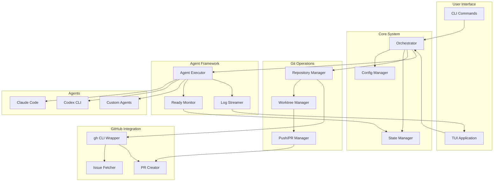
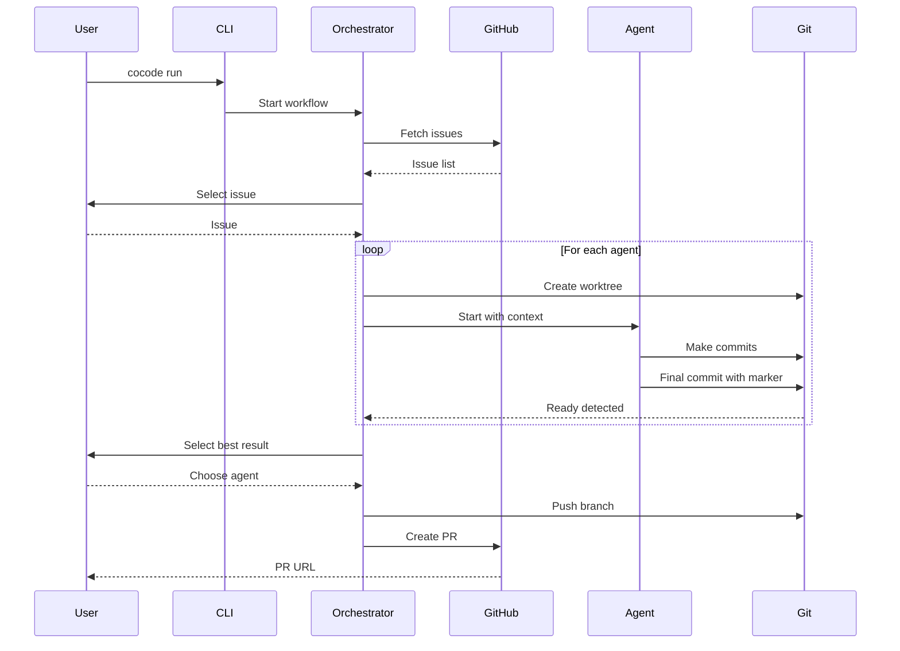
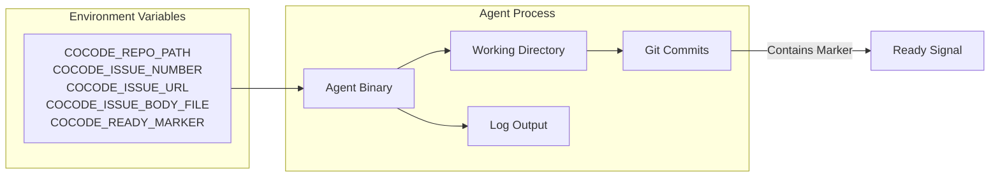
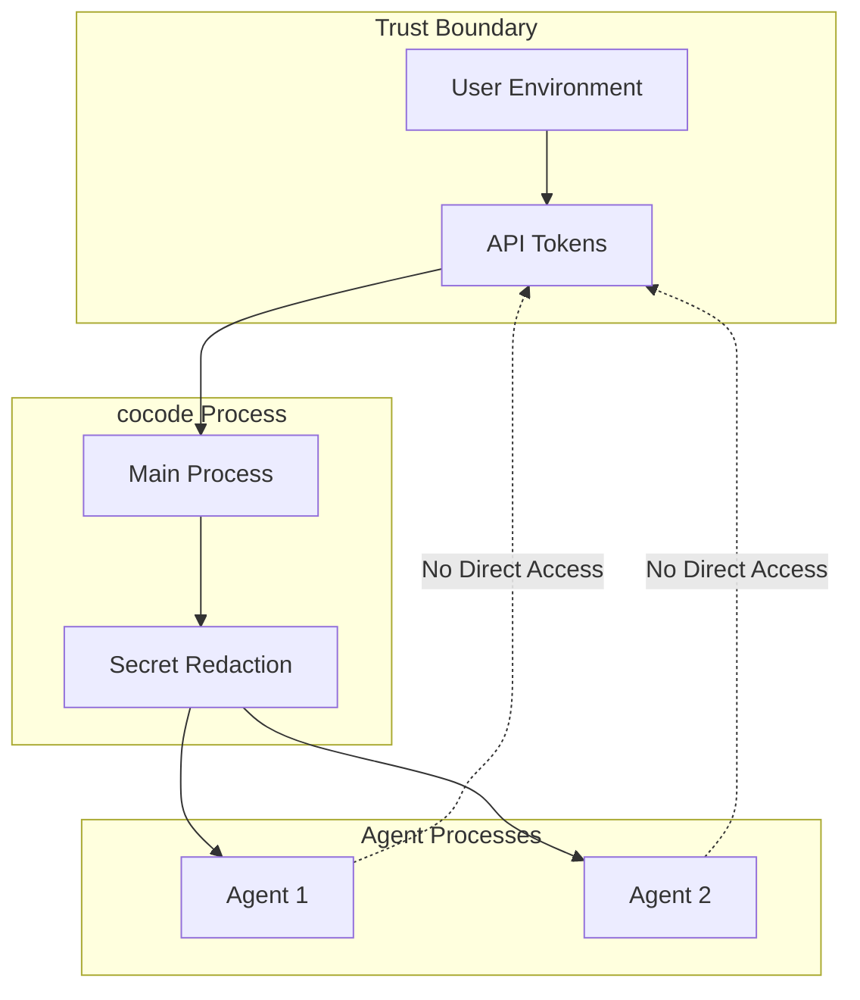

# cocode System Architecture

## Overview

cocode orchestrates multiple code agents to solve GitHub issues in parallel, providing a TUI for monitoring and selection.

## High-Level Architecture



## Component Responsibilities

### User Interface Layer
- **CLI**: Entry point for all commands (init, run, doctor, clean)
- **TUI**: Real-time monitoring and interaction interface

### Core System
- **Orchestrator**: Coordinates the entire workflow
- **Config Manager**: Handles .cocode/config.json
- **State Manager**: Manages .cocode/state.json and recovery

### Git Operations
- **Repository Manager**: Local repo detection and cloning
- **Worktree Manager**: Creates and manages git worktrees
- **Push/PR Manager**: Handles branch pushing and PR creation

### GitHub Integration
- **gh CLI Wrapper**: All GitHub API operations via gh
- **Issue Fetcher**: Retrieves and filters issues
- **PR Creator**: Creates pull requests with proper formatting

### Agent Framework
- **Agent Executor**: Subprocess management for agents
- **Ready Monitor**: Watches for completion markers
- **Log Streamer**: Real-time log streaming to TUI

## Data Flow



## File System Layout

```
project-root/
├── .cocode/
│   ├── config.json          # User configuration
│   ├── state.json           # Current run state
│   └── logs/
│       ├── claude.log       # Agent logs
│       └── codex.log
├── cocode_claude/           # Claude's worktree
├── cocode_codex/            # Codex's worktree
└── original-repo/           # Main repository
```

## Agent Communication Protocol



## Security Model



## Performance Considerations

- **Concurrent Execution**: All agents run in parallel
- **Streaming Logs**: Line-buffered output prevents memory bloat
- **Lazy Loading**: Issues fetched on-demand
- **Worktree Reuse**: Existing worktrees are reused when possible
- **State Recovery**: Interrupted runs can be resumed
